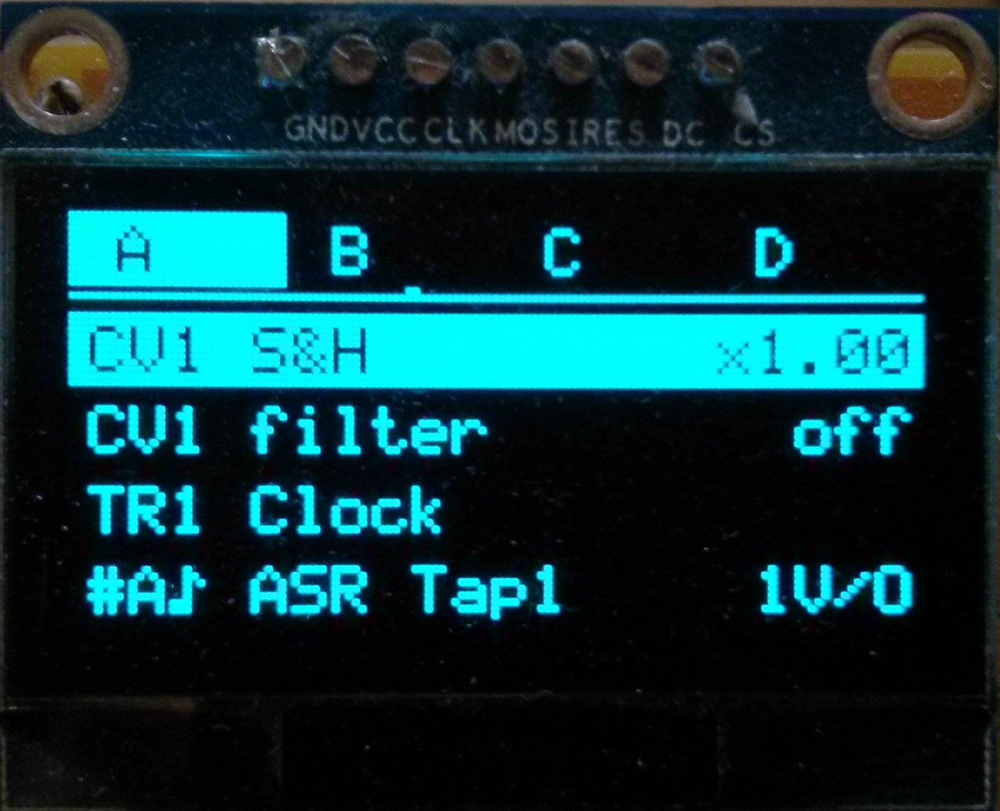

# Notes about this branch
(`abandoned/refactoring`)

The state of the o\_C framework always bothered me. It was an experiment that got out of hand :)

So this was an attempt to clean up a few things. It started harmless enough ("the autotune UI could be more helpful") and then, true to form, feature-creeped to include...
- An overhaul of the IO system, so apps now process an `IOFrame` instead of manipulating the ADC/DAC/... directly (which would also help for a T4 port).
- `IOFrame` also includes a bunch of helper functions (`set_gate_value`, `set_pitch_value`, reading scaled ADC values) that reduce duplication in apps.
- This also allows a unified way to add attenuation to input channels (`IO Settings`) and a global settings menu.
- The global settings menu can display the function of IO ports. Aach app can fill out a dynamic description for the TRx, CVx and outputs (see below).
- Also, `Quantermain` can now use other channels' outputs as sources.
- The load/save code from TU was ported over. That paves the way for presets except there's still a lack of non-volatile storage.
- Apps are now "proper" objects instead of a bunch of function pointers.
- Removed some obviously wasteful implementations.
- Other random poking.

## IO Settings
Here's what the IO setting menu might look like for the *CopierMaschine* app:

- "S&H" is the app-generated description for CV1 and the attenuation.
- Filtering on CVs is off, so it reads an more immediate value. 
- "Clock" is the app-generated description for TR1.
- The last line describes output A: Pitch, "ASR Tap 1", scaling is 1V/O.

## Caveats...
- **WARNING** It definitely has bugs and might not even compile, but here it is for posterity.
- With the additional IO processing and the app virtual functions, performance takes a hit (e.g. the ASR app processor time goes from 16% to 28%). I expect that could be streamlined away with some care.
- A lot of things haven't actually been tested, they just (hopefully) compile :D
- It doesn't include any newer fixes.
- Support for the non-eurorack hardware variants still needs updating.
- No guarantees that things aren't verschlimmbessert :)

Essentially I didn't feel like rebasing/fixing the merge conflicts introduced with the VOR support in the main repo. It might not actually be that much work.
